---
title: Research
date: 2026-09-03
type: landing

sections:
  - block: markdown
    content:
      title: |
        Our research lines
      text: |
         

        The RLA Lab is interested in how the development of synthetic biology can revolutionise biotechnologies 
        and help us move towards a sustainable bio-based economy. We engineer microorganisms for a wide range of 
        applications, which span from the production of novel foods and alternative proteins to chemicals and fuels.  
        We are developing:

        

          

            <a href="#tools" class="rectangle"><i class="fa-solid fa-screwdriver-wrench"></i> New tools</a>
          

          

            <a href="#products" class="rectangle"><i class="fa-solid fa-flask-vial"></i> New products</a>
          

          

            <a href="#processes" class="rectangle"><i class="fa-solid fa-arrows-rotate"></i> New processes</a>
          

          

            <a href="#knowledge" class="rectangle"><i class="fa-solid fa-magnifying-glass"></i> New knowledge</a>
          

          

            <a href="#food" class="rectangle"><i class="fa-solid fa-burger"></i> New foods</a>
          

        

  - block: markdown
    id: tools
    content:
      title:
      text: |
        <h2>New synthetic biology approaches for metabolic control</h2>

        
The group is interested in using and developing new synthetic biology tools that allow us to precisely 
        manipulate microbial cells in a reliable, predictable, and standardized way. In particular, we are interested 
        in cutting-edge techniques that enable fine-tuning of metabolic pathways.

        
For further reading, see some of our recent articles and reviews:

        

          <!-- First Article -->
          

            <a href="https://doi.org/10.15252/msb.202110523" target="_blank" style="text-decoration: none; display: flex; align-items: center; width: 100%;">
              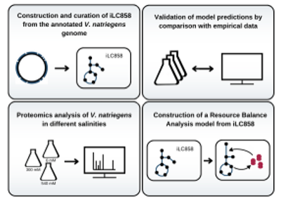
              

                <strong>The first genome-scale metabolic model of <i>Vibrio natriegens</i></strong> 
                <em>Molecular Systems Biology</em> (2023)
              

            </a>
          

          
          <!-- Second Article -->
          

            <a href="https://doi.org/10.1038/s42003-023-05202-5" target="_blank" style="text-decoration: none; display: flex; align-items: center; width: 100%;">
              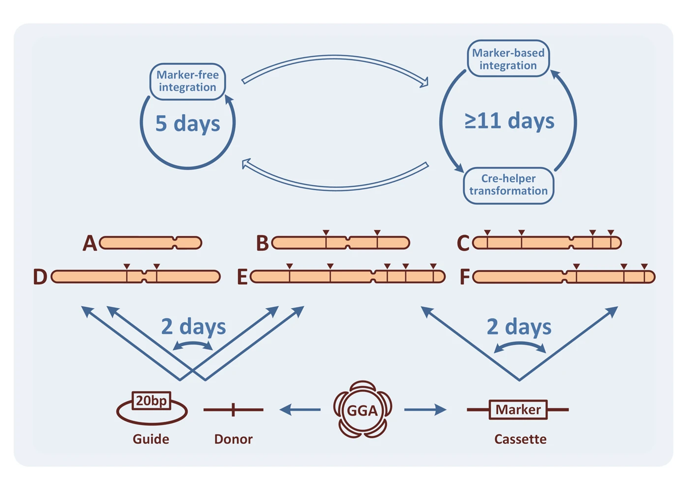
              

                <strong>A <i>Yarrowia lipolytica</i> versatile engineering toolkit with CRISPR compatibilities</strong> 
                <em>Communications Biology</em> (2023)
              

            </a>
          

          <!-- Third Article -->
          

            <a href="https://doi.org/10.1038/s41467-022-32603-7" target="_blank" style="text-decoration: none; display: flex; align-items: center; width: 100%;">
              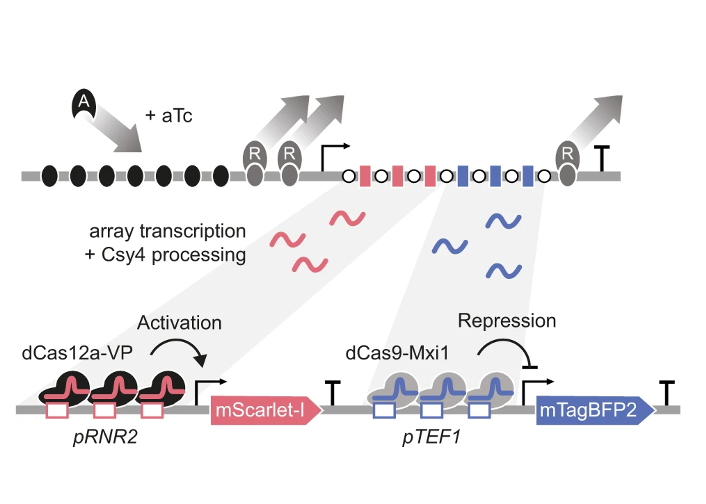
              

                <strong>Our Multiplexing CRISPRai system for accelerating metabolic engineering</strong> 
                <em>Nature Communications</em> (2022)
              

            </a>
          

          <!-- Fourth Article -->
          

            <a href="https://www.science.org/doi/10.1126/sciadv.abm5091" target="_blank" style="text-decoration: none; display: flex; align-items: center; width: 100%;">
              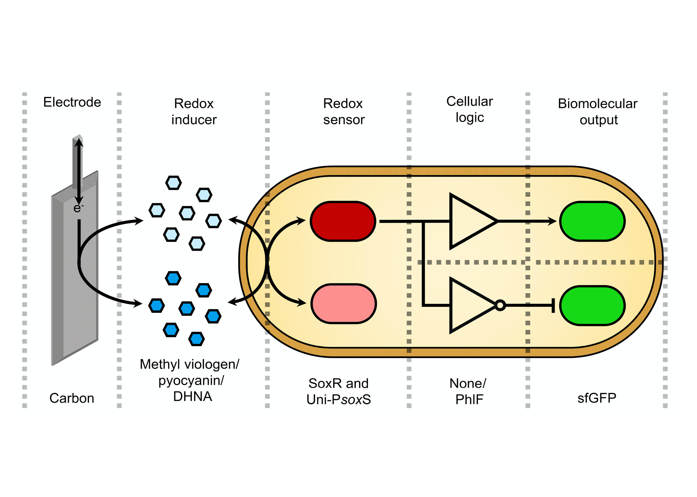
              

                <strong>Electric control of gene expression</strong> 
                <em>Science Advances</em> (2022)
              

            </a>
          

          
          <!-- Fifth Article -->
          

            <a href="https://doi.org/10.1038/s41467-020-15053-x" target="_blank" style="text-decoration: none; display: flex; align-items: center; width: 100%;">
              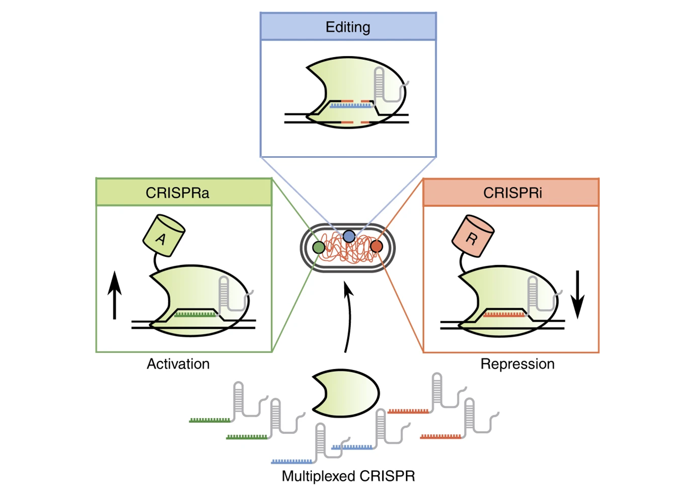
              

                <strong>Multiplexing CRISPR for accelerating metabolic engineering - a review</strong> 
                <em>Nature Communications</em> (2020)
              

            </a>
          

        

         
        <h3>Artificial Intelligence approaches</h3>
        
We are actively developing and applying AI and machine learning tools to accelerate the design-build-test-learn cycle and predict microbial behavior.

        

          <!-- Article 1 -->
          

            <a href="https://www.nature.com/articles/s41467-026-72837-3" target="_blank" style="text-decoration: none; display: flex; align-items: center; width: 100%;">
              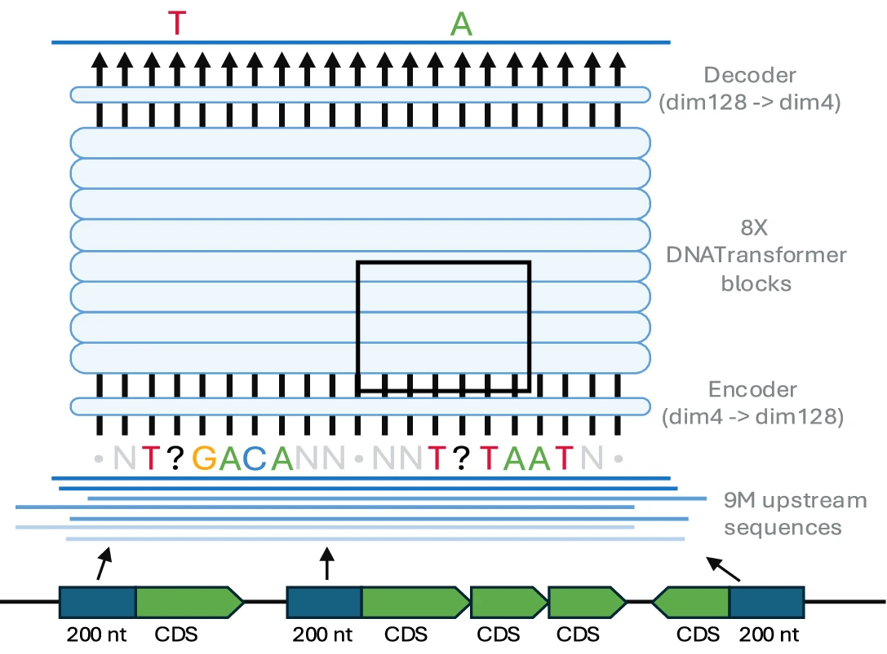
              

                <strong>PromoterAtlas: decoding regulatory sequences across Gammaproteobacteria using a transformer model</strong> 
                <em>Nature Communications</em> (2026)
              

            </a>
          

          <!-- Article 2 -->
          

            <a href="https://www.nature.com/articles/s41467-026-75956-z" target="_blank" style="text-decoration: none; display: flex; align-items: center; width: 100%;">
              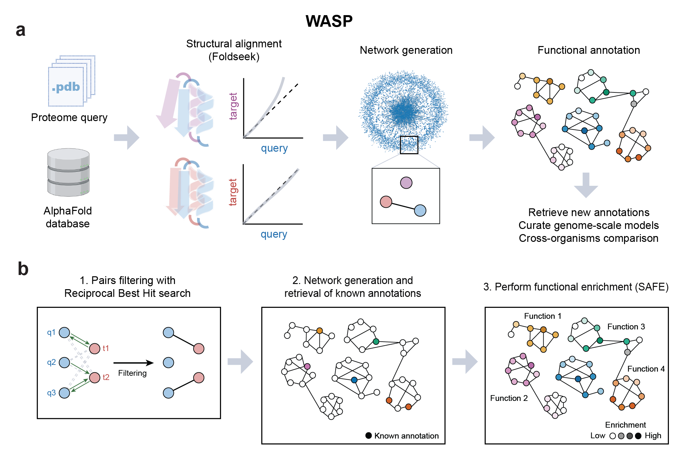
              

                <strong>WASP: a pipeline for functional annotation prediction based on AlphaFold structural models</strong> 
                <em>Nature Communications</em> (2026)
              

            </a>
          

        

  - block: markdown
    id: products
    content:
      title:
      text: |
        <h2>Metabolic engineering for sustainable bioproduction</h2>

        
The manipulation and optimization of microbial metabolic pathways are the keys for biotechnology and a 
        bio-based economy. Our research group is highly interested in hacking metabolism using synthetic biology 
        tools to create new properties and enhanced behaviors in microbial cells. The engineering strategies are 
        not only designed to produce new high-value products or higher amounts of pre-existing products but also 
        to facilitate the downstream and upstream parts of the bioprocesses.

        
The lab is interested in engineering both conventional (such as <i>S. cerevisiae</i> and <i>E. coli</i>) and 
        non-conventional organisms, including our widely used yeast <i>Y. lipolytica</i>.

        
For further reading, see some of our recent articles and reviews:

        

          <!-- First Article -->
          

            <a href="https://doi.org/10.1038/s44160-026-01076-7" target="_blank" style="text-decoration: none; display: flex; align-items: center; width: 100%;">
              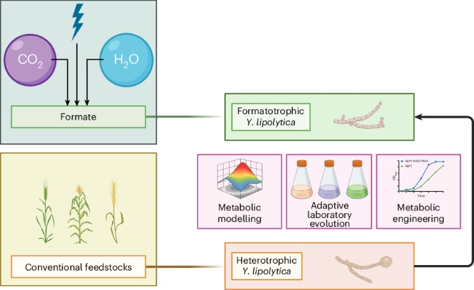
              

                <strong>Engineering de novo formatotrophy in the non-model yeast Y. lipolytica</strong> 
                <em>Nature Synthesis</em> (2026)
              

            </a>
          

          
          <!-- Second Article -->
          

            <a href="https://doi.org/10.1016/j.tibtech.2022.07.006" target="_blank" style="text-decoration: none; display: flex; align-items: center; width: 100%;">
              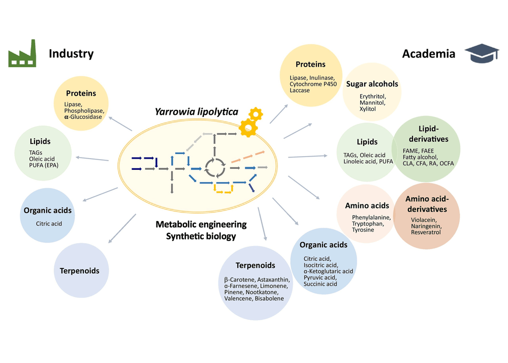
              

                <strong>Our review on <i>Yarrowia</i> and why it is one of our favorite hosts</strong> 
                <em>Trends in Biotechnology</em> (2023)
              

            </a>
          

          <!-- Third Article -->
          

            <a href="https://doi.org/10.1038/s41589-021-00836-0" target="_blank" style="text-decoration: none; display: flex; align-items: center; width: 100%;">
              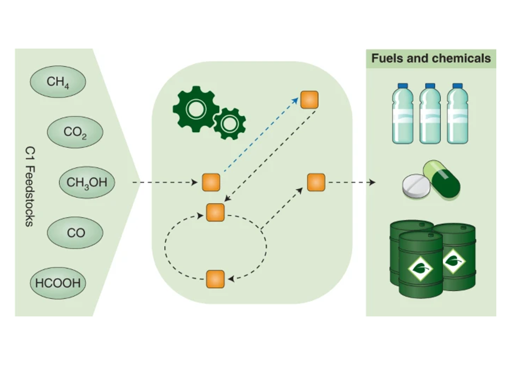
              

                <strong>Unlocking C1 utilization with metabolic engineering - a review</strong> 
                <em>Nature Chemical Biology</em> (2021)
              

            </a>
          

        

  
  - block: markdown
    id: processes
    content:
      title:
      text: |
        <h2>Synthetic microbial communities for biotechnology</h2>

        
Microbial communities are important for industrial bioprocesses, such as food production. We are interested 
        in how microbial communities can be engineered and how synthetic biology can help to establish novel communities 
        of microbes with applications in biotechnology.

        
For further reading, see some of our recent articles and reviews:

        

          <!-- First Article -->
          

            <a href="https://doi.org/10.1038/s41467-026-72389-6" target="_blank" style="text-decoration: none; display: flex; align-items: center; width: 100%;">
              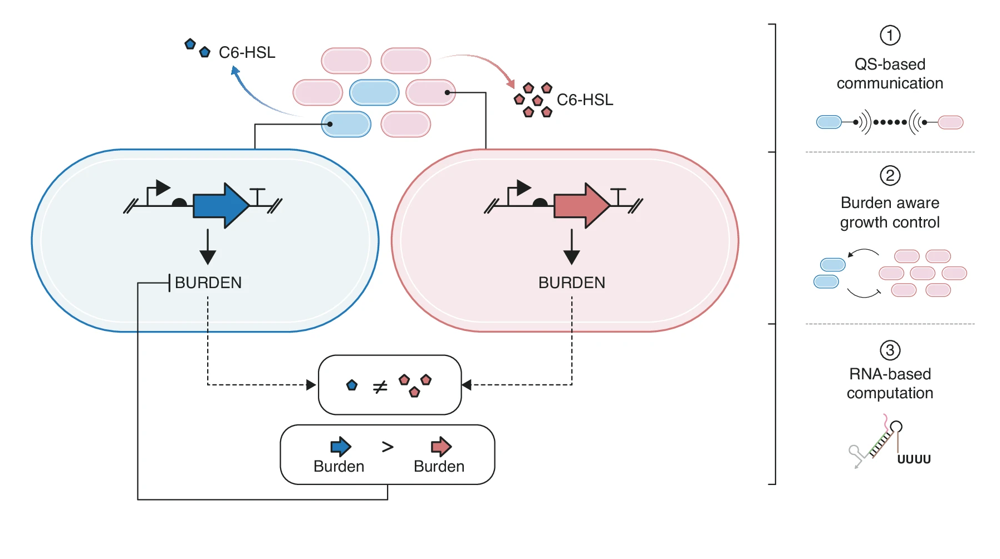
              

                <strong>Burden-aware feedback control of microbial consortia</strong> 
                <em>Nature Communications</em> (2026)
              

            </a>
          

          <!-- Second Article -->
          

            <a href="https://doi.org/10.1038/s41589-025-02081-1" target="_blank" style="text-decoration: none; display: flex; align-items: center; width: 100%;">
              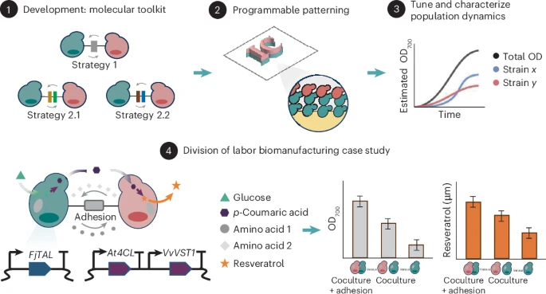
              

                <strong>Programmable cell–cell adhesion in synthetic yeast communities for improved bioproduction</strong> 
                <em>Nature Chemical Biology</em> (2025)
              

            </a>
          

          <!-- Third Article -->
          

            <a href="https://doi.org/10.1038/s41564-023-01596-4" target="_blank" style="text-decoration: none; display: flex; align-items: center; width: 100%;">
              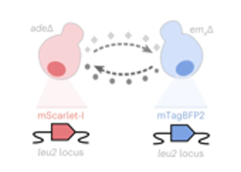
              

                <strong>A toolkit to make yeast synthetic communities for bioproduction</strong> 
                <em>Nature Microbiology</em> (2024)
              

            </a>
          

          <!-- Fourth Article -->
          

            <a href="https://doi.org/10.1016/j.biortech.2024.131232" target="_blank" style="text-decoration: none; display: flex; align-items: center; width: 100%;">
              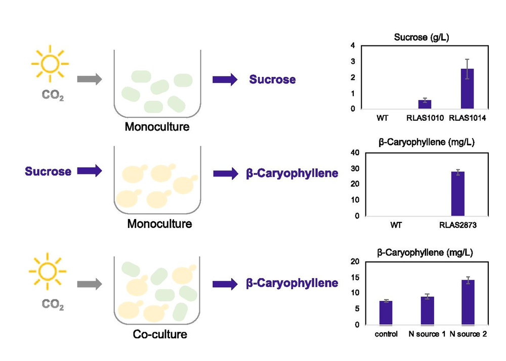
              

                <strong>Synthetic lichen, from CO2 and light to products in <i>Yarrowia</i></strong> 
                <em>Bioresource Technology</em> (2024)
              

            </a>
          

          <!-- Fifth Article -->
          

            <a href="https://doi.org/10.1038/s41589-023-01341-2" target="_blank" style="text-decoration: none; display: flex; align-items: center; width: 100%;">
              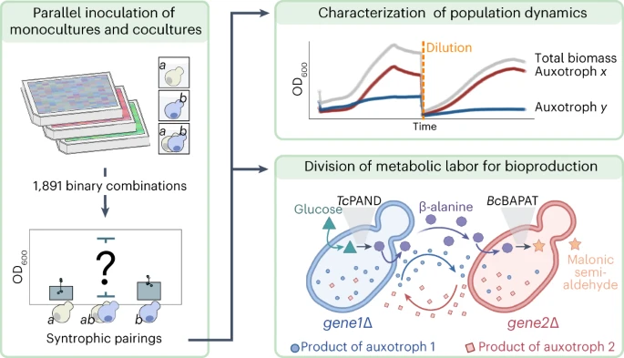
              

                <strong>Synthetic yeast communities with syntrophy enhances bioproduction</strong> 
                <em>Nature Chemical Biology</em> (2023)
              

            </a>
          

          <!-- Sixth Article -->
          

            <a href="https://doi.org/10.1016/j.copbio.2022.102706" target="_blank" style="text-decoration: none; display: flex; align-items: center; width: 100%;">
              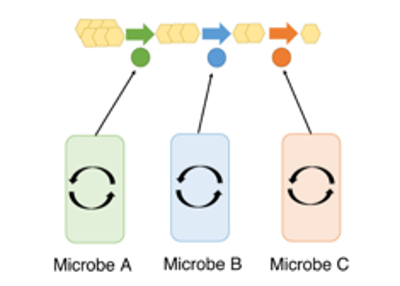
              

                <strong>A review on division of labour</strong> 
                <em>Current Opinion in Biotechnology</em> (2022)
              

            </a>
          

          <!-- Seventh Article -->
          

            <a href="https://doi.org/10.1016/j.tibtech.2018.11.002" target="_blank" style="text-decoration: none; display: flex; align-items: center; width: 100%;">
              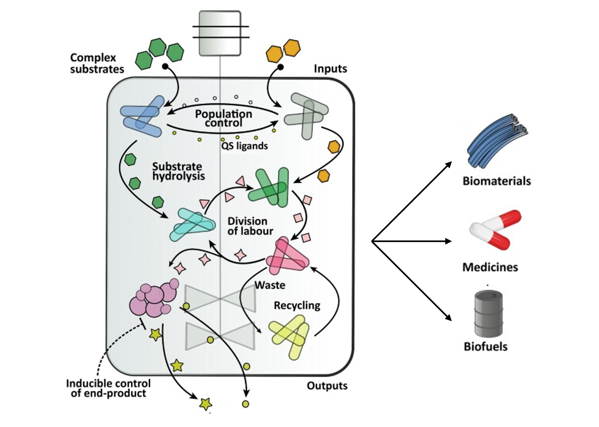
              

                <strong>A review on synthetic microbial communities for biotechnology</strong> 
                <em>Trends in Biotechnology</em> (2019)
              

            </a>
          

        

  - block: markdown
    id: knowledge
    content:
      title:
      text: |
        <h2>Understanding phenotypic heterogeneity and how it affects production</h2>

        
The development of single-cell technologies has enabled the study of individual cell behaviors within a population. Such variations can impact total bioproduction in biotechnological processes. We aim to understand heterogeneity and develop tools to control it to our advantage.

        
For further reading, see some of our recent articles and reviews:

        

          <!-- First Article -->
          

            <a href="https://www.nature.com/articles/s41467-025-67408-x" target="_blank" style="text-decoration: none; display: flex; align-items: center; width: 100%;">
              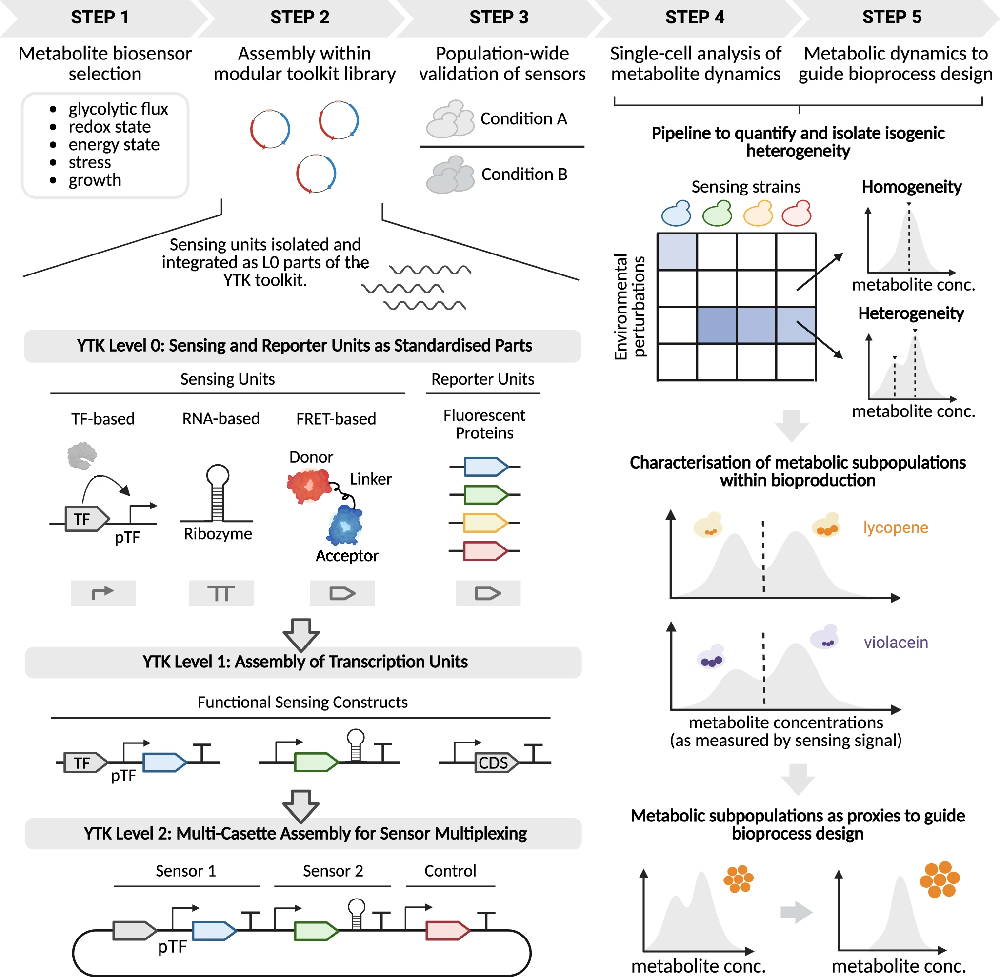
              

                <strong>Single cell profiling framework reveals metabolic subpopulations as drivers of bioproduction heterogeneity</strong> 
                <em>Nature Communications</em> (2025)
              

            </a>
          

          
          <!-- Second Article -->
          

            <a href="https://doi.org/10.1038/s41467-024-50602-8" target="_blank" style="text-decoration: none; display: flex; align-items: center; width: 100%;">
              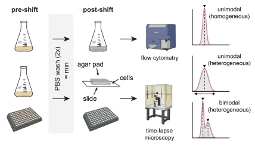
              

                <strong>Phenotypic heterogeneity follows a growth-viability tradeoff in response to amino acid identity</strong> 
                <em>Nature Communications</em> (2024)
              

            </a>
          

        

  - block: markdown
    id: food
    content:
      title:
      text: |
        <h2>Microbial food: traditional, biomass and precision fermentation</h2>

        
Microbial food is a key area of the lab. Many of our other research lines directly relate to the development of tools, products, and processes that are essential to making sustainable food from microbes. We are highly interested in applying synthetic biology to advance precision fermentation, traditional fermentation, and microbial biomass for the future of food systems.

        
For further reading, see some of our recent reviews:

        

          <!-- First Article -->
          

            <a href="https://doi.org/10.1038/s43016-026-01380-7" target="_blank" style="text-decoration: none; display: flex; align-items: center; width: 100%;">
              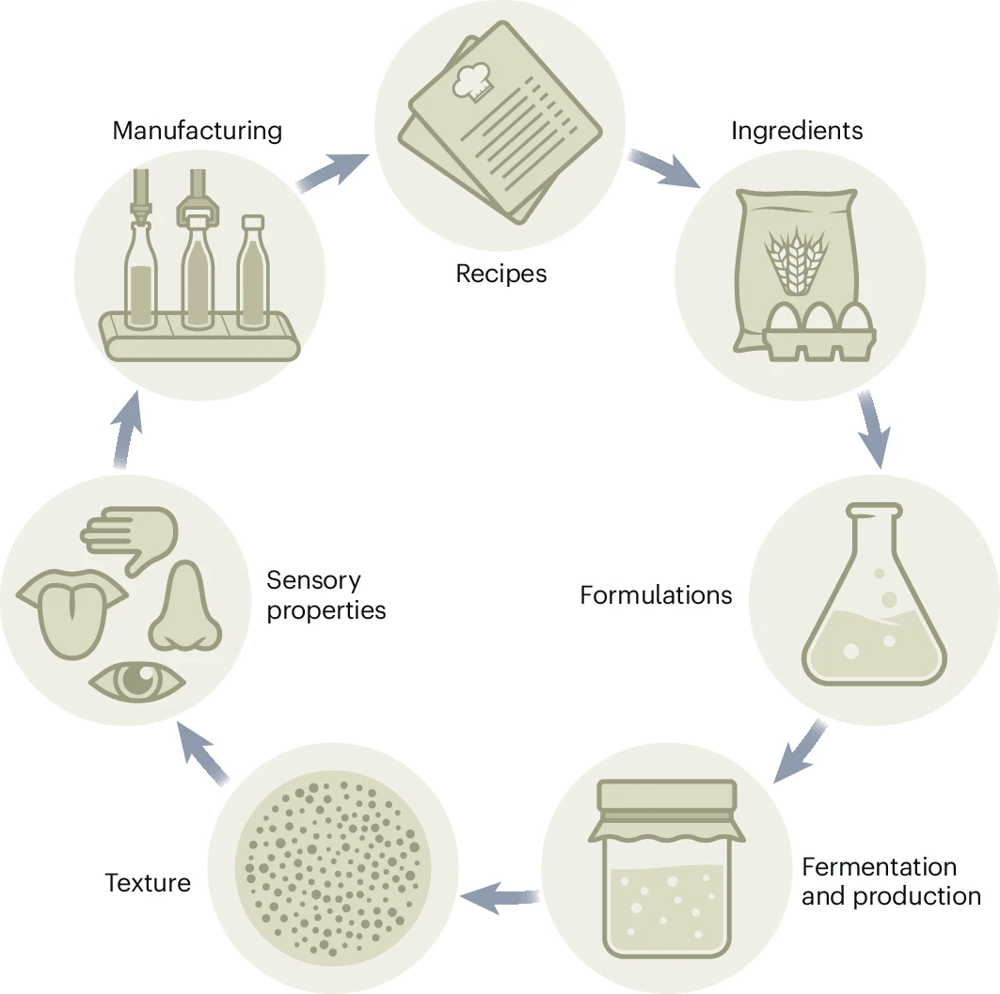
              

                <strong>Artificial intelligence for food innovation</strong> 
                <em>Nature Food</em> (2026)
              

            </a>
          

          <!-- Second Article -->
          

            <a href="https://doi.org/10.1038/s41467-026-73987-0" target="_blank" style="text-decoration: none; display: flex; align-items: center; width: 100%;">
              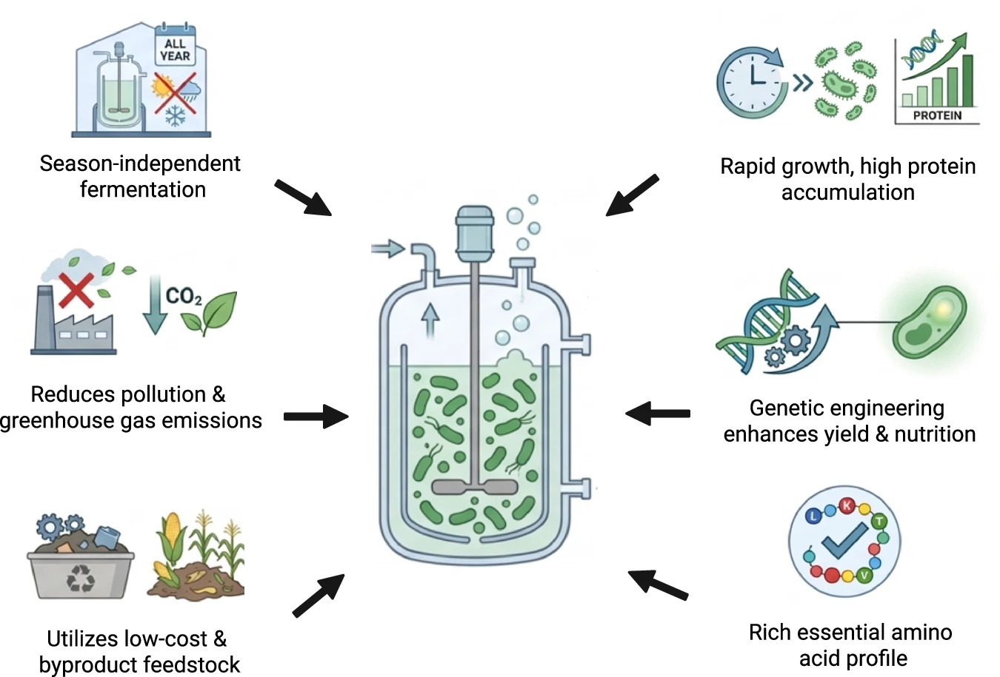
              

                <strong>Navigating adoption barriers for microbial proteins in future food</strong> 
                <em>Nature Communications</em> (2026)
              

            </a>
          

          <!-- Third Article -->
          

            <a href="https://doi.org/10.1038/s41467-023-37891-1" target="_blank" style="text-decoration: none; display: flex; align-items: center; width: 100%;">
              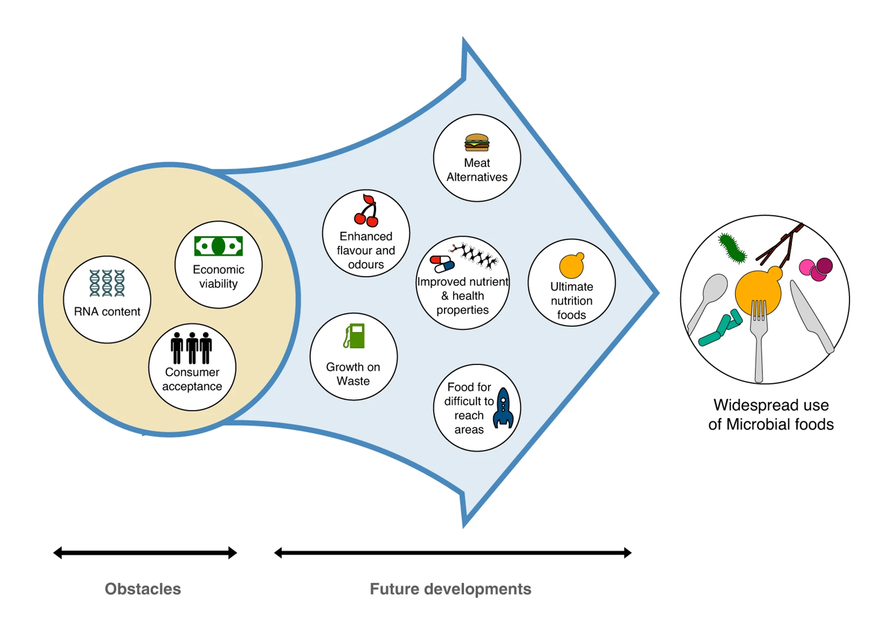
              

                <strong>The microbial food revolution</strong> 
                <em>Nature Communications</em> (2023)
              

            </a>
          

        

---